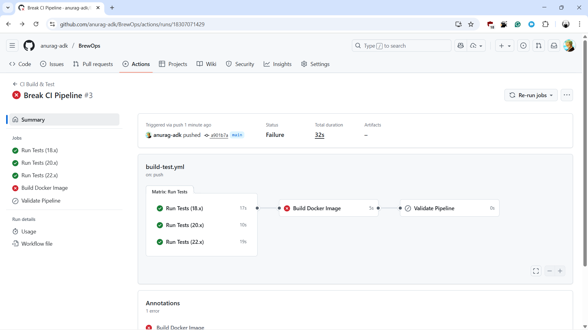
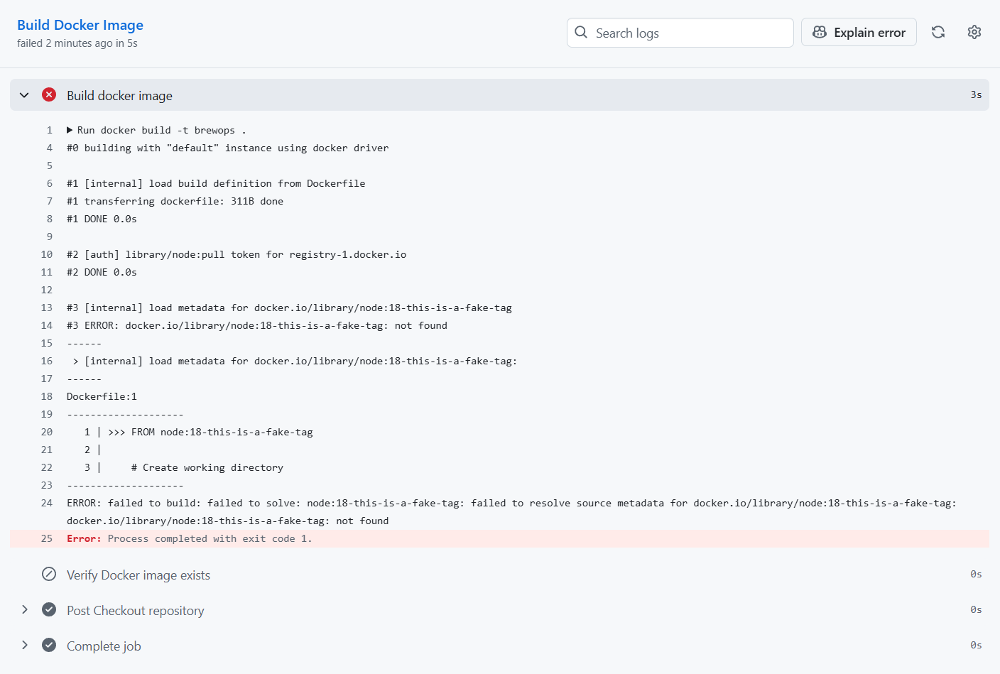
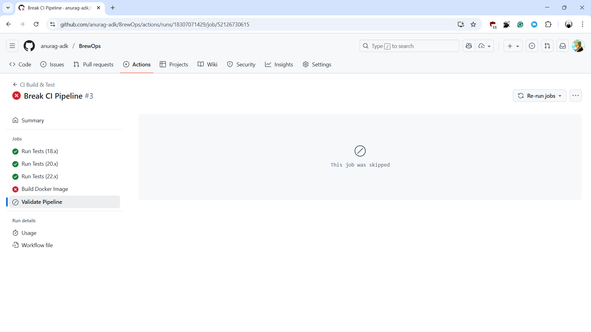
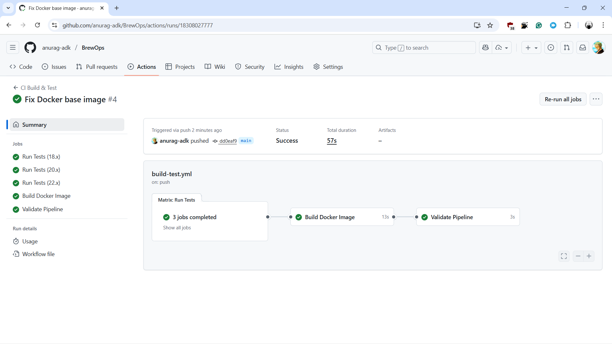

# 📝BrewOps CI Build & Test Pipeline Analysis

## 🕹️How the Pipeline Works

### Trigger

The pipeline automatically runs on:

- Push events to the `main` branch
- Pull requests targeting the `main` branch

---

### 🛠️ Jobs

| SN  | Job          | Purpose                           | Dependencies                | Key Actions                                                                                                                                          |
| --- | ------------ | --------------------------------- | --------------------------- | ---------------------------------------------------------------------------------------------------------------------------------------------------- |
| 1.  | **ci-test**  | Test on multiple Node.js versions | None                        | • Matrix testing (Node 18.x, 20.x, 22.x)<br>• Install dependencies `npm ci`<br>• Execute tests `npm test`<br>• Server validation on absense of tests |
| 2.  | **ci-build** | Build Docker image                | Needs `ci-test`             | • Build Docker image tagged `brewops`<br>• Verify image creation                                                                                     |
| 3.  | **validate** | Validate pipeline completion      | Needs `[ci-test, ci-build]` | • Confirm pipeline completion<br>• Provide success summary                                                                                           |

---

### The Needs Keyword

The `needs` keyword creates job dependencies:

- `ci-build` needs `ci-test` to complete first
- `validate` needs both `ci-test` and `ci-build` to complete

This ensures proper execution order and prevents unnecessary Docker builds if tests fail, saving time and resources.

---

## 🐛 Breaking & Fixing the Pipeline

### Breaking the Pipeline

To demonstrate how pipeline failures work, we'll intentionally break the [Dockerfile](./Dockerfile) by changing the base image to a non-existent tag:

**Original Version (Working):**

```dockerfile
FROM node:18-alpine
```

**Broken Version:**

```dockerfile
FROM node:18-this-is-a-fake-tag
```

---

### Expected Pipeline Behavior

When this broken Dockerfile is pushed:

1. **ci-test job** - ✅ should still pass (doesn't use Docker)
2. **ci-build job** - ❌ should fail when trying to build the Docker image
3. **validate job** - ❌ shouldn't run due to `needs` dependency on ci-build

---

### 📸 Error Snapshots & Analysis




The Docker build failed with an error message indicating:

- The specified image tag doesn't exist
- Docker cannot pull the base image
- Build process stops at the first `FROM` instruction



Here, the `needs` keyword prevented cascading issues and,

- The `validate` job didn't waste resources running when `ci-build` failed
- The pipeline stopped at the point of failure
- Clearly indicating that the issue was in the Docker build stage

---

### 🔧 The Fix

To fix the pipeline I followed the following steps:

1. Reverted the Dockerfile to use the correct base image:
   ```dockerfile
   FROM node:18-alpine
   ```
2. Committed and pushed the fix:

   ```bash
   # Staged the modified Dockerfile
   git add Dockerfile

   # Commited with a clear message
   git commit -m "Fix Docker base image"

   # Pushed the changes to the main branch
   git push origin main
   ```

3. Watched the pipeline turn green again
   

This demonstrates how proper CI/CD design with job dependencies helps isolate, identify and visualize issues quickly!

> Access the failed workflow run [Here](https://github.com/anurag-adk/BrewOps/actions/runs/18307071429)<br>
> Access the fixed workflow run [Here](https://github.com/anurag-adk/BrewOps/actions/runs/18308027777)

---
